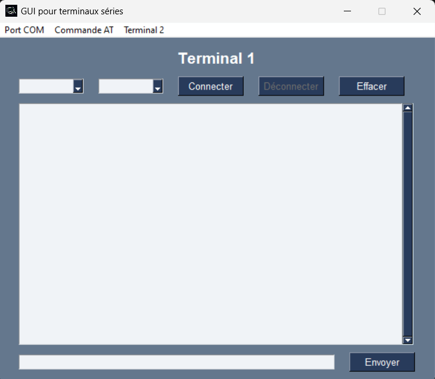
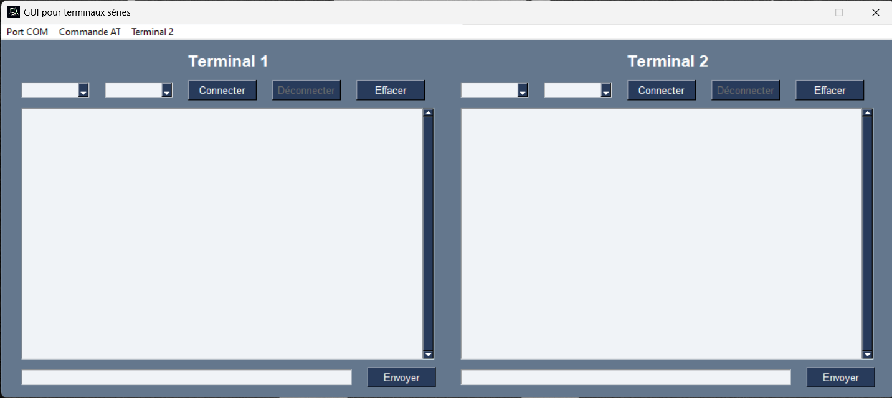
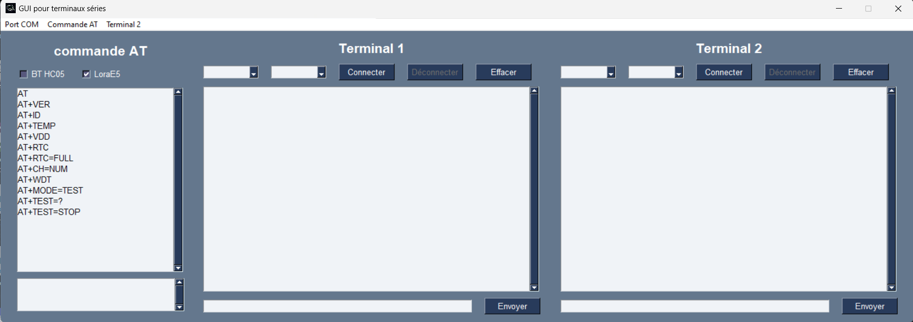

# FreeSerial

## Deux terminaux série et panneau de commande AT pour HC05 et LoraE5

### librairies utilisées :
- **threading**                pour utiliser les threads
- **PySimpleGUI**              pour faire une interface graphique (pip install pysimplegui)
- **serial**                   pour utiliser la com série         (pip install pyserial)
- **serial.tools.list_ports**  pour lister les port utilisés      (pip install serial-tool)

### Ligne 7:  
Si vous voulez l'icon de l'application, if faut modifier la ligne
**mon_icon = "~/Desktop/FreeSerial/img/th.ico" remplacer par votre chemin** 

### A finir :

Compléter les commandes AT et les infos associées

### Aperçu:

