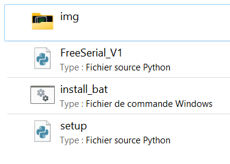
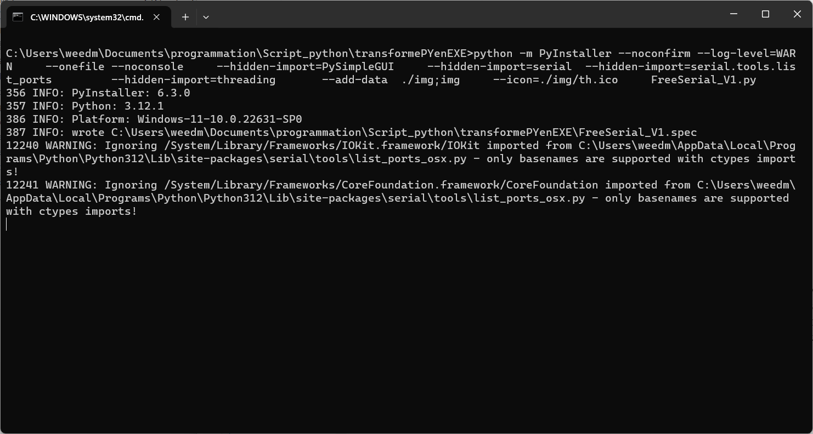

# Transformez facilement un programme en python en .exe

## Librairie nécessaire 

**PyInstaller** (pip install -U pyinstaller)

## Préparation

**1.** On crée un dossier de travail nommé **transformePYenEXE** par exemple  
**2.** On crée un dossier nommé **img** qui contiendra l’icône de l'application au format .ico  
**3.** On crée un fichier vide nommé **setup.py**  
**4.** On crée un fichier vide pour le moment nommé **install_bat.bat**  
**5.** On y place le fichier programme à transformer

Voici l'arborescence du dossier **transformePYenEXE**
 

Ici je vais transformer le programme **FreeSerial_V1.py**

## Création du ficher de transformation 

On édite le fichier **install_bat.bat**

On y copie ces lignes :

```bat
python -m PyInstaller --noconfirm --log-level=WARN ^  
    --onefile --noconsole ^  
    --hidden-import=PySimpleGUI ^  
    --hidden-import=serial ^  
	--hidden-import=serial.tools.list_ports ^  
	--hidden-import=threading ^  
	--add-data  ./img;img ^  
    --icon=./img/th.ico ^  
    FreeSerial_V1.py  
```

**--onefile --noconsole** un seule fichier, sans terminal  
**--hidden-import** pour importer les librairies utiles au programme  
**--add-data** pour faire le lien avec le dossier img  
**--icon** pour ajouter le lien de l’icône  
**FreeSerial_V1.py** le programme à transformer


## Transformation du programme

Double-cliquez sur le fichier **install_bat.bat**

le terminal s'ouvre et la transformation commence :

 

une fois terminé, 2 nouveaux dossiers nommés **built** et **dist** et un fichier nommé **FreeSerial_V1.spec** ont été crée 

le programme en **FreeSerial_V1.exe** se trouve dans le dossier **dist**, un fois que vous l'avez récupérer et déplacer vous pouvez supprimer ces 2 dossier et le fichier FreeSerial_V1.spec